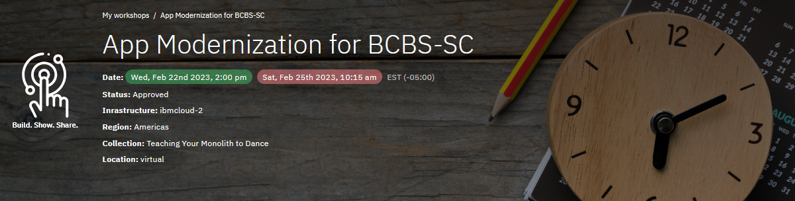
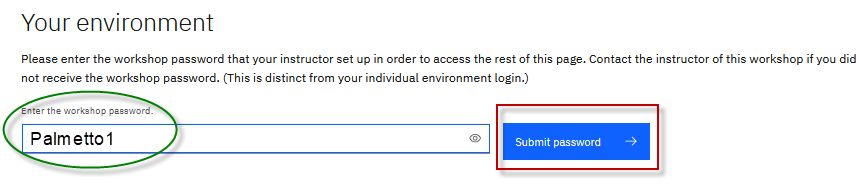

<h2 style="color:black">Accessing lab environment</h2>

  

1. Go to the Attendee Lab URL from the **Workshop Labs** menu item, 

    From the **Workshop Labs** menu item, select the Lab Environment URL for the specific lab(s) you want to run

    

     
 
2. Enter the workshop password: **Palmetto1** and click **Submit** button

    

     

3. Click the URL to your environment and enter the password that is displayed on the page, which is unique to your environment. 

    
	

4. The **Published Service** provides direct access to the VM environment that is used for all of the labs in the workshop. 

     
     
5. Follow the lab guide for instructions for accessing the environment through the **Published Service**  

    **Note: **Each lab guides include the information acessing the VM, how to login to the VM, login credentials, etc.  

  
  